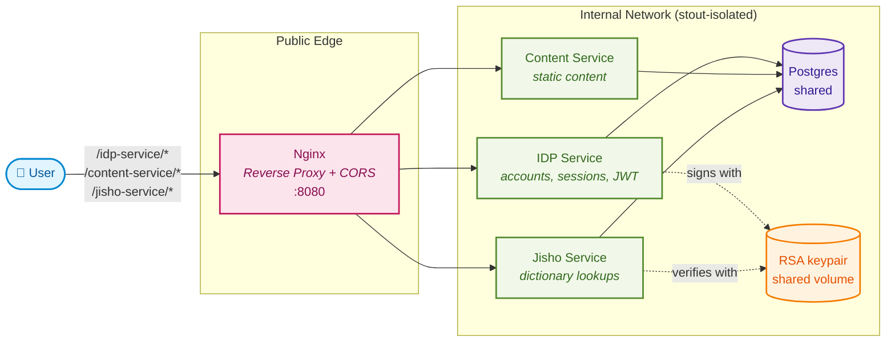

# Welcome to the documentation

This documentation is personal and i document some things in here that i might need or things that aren't often used. So this is basically treated as a cheat sheet ;

## Content

- [Welcome to the documentation](#welcome-to-the-documentation)
  - [Content](#content)
  - [Services](#services)
  - [Architecture](#architecture)
  - [Request flow: login + authenticated call](#request-flow-login--authenticated-call)
  - [⚙️ Commands](#️-commands)
    - [Quickstart Docker Compose](#quickstart-docker-compose)
    - [Generate new module](#generate-new-module)
  - [🔗 Sources](#-sources)

## Services

| Service | Purpose | Public route (via nginx) |
| --- | --- | --- |
| [idp-service](./idp-service/README.MD) | Accounts, login/session/CSRF cookies, JWT issuing, JWKS | `/idp-service/*` |
| [content-service](./content-service/README.md) | Serves static content (e.g. CV download) | `/content-service/*` |
| [jisho-service](./jisho-service/README.MD) | Japanese-English dictionary lookups, protected by a JWT | `/jisho-service/*` |
| [nginx](./nginx/README.md) | Single public entrypoint, reverse proxy + CORS for the services above | `:8080` |
| [example-service](./example-service/README.md) | Scaffold/template used as a starting point for new Go services (not part of docker compose) | n/a |

All application services (`idp-service`, `content-service`, `jisho-service`) share a single Postgres instance and sit on an `internal: true` docker network — only `nginx` (and `postgres`, for local tooling) are reachable from outside the compose network. `idp-service` and `jisho-service` share an RSA keypair, generated once by the `rsa-key-generator` init container, so that `idp-service` can sign JWTs and `jisho-service` (or any other internal service) can verify them without calling back into `idp-service`.

## Architecture



> Note: `idp-service`, `content-service` and `jisho-service` do not publish ports of their own — `nginx` is the only container reachable from outside the compose network (besides `postgres`, which is exposed on `5432` for local tooling/inspection).

## Request flow: login + authenticated call

A typical flow: a client logs in through `idp-service` to get a session cookie + JWT, then uses that JWT to call a protected endpoint on another internal service (e.g. `jisho-service`), which verifies it locally against the shared RSA public key instead of calling back into `idp-service`.

```mermaid
sequenceDiagram
    actor Client
    participant Nginx as Nginx :8080
    participant IDP as IDP Service
    participant Jisho as Jisho Service

    Client->>Nginx: POST /idp-service/v1/login
    Nginx->>IDP: POST /v1/login
    IDP-->>Nginx: 200 Set-Cookie: session_token<br/>body: { jwt, csrfToken }
    Nginx-->>Client: 200 Set-Cookie: session_token<br/>body: { jwt, csrfToken }

    Client->>Nginx: GET /jisho-service/v1/search?keyword=犬<br/>Authorization: Bearer &lt;jwt&gt;
    Nginx->>Jisho: GET /v1/search?keyword=犬<br/>Authorization: Bearer &lt;jwt&gt;
    Jisho->>Jisho: verify JWT with shared RSA public key
    Jisho-->>Nginx: 200 { meta, data }
    Nginx-->>Client: 200 { meta, data }
```

## ⚙️ Commands

### Quickstart Docker Compose

```bash
docker compose up
```

Once running, the stack is reachable at `http://localhost:8080` (see each service's README for its routes/curls) and Postgres is reachable at `localhost:5432` (`user=golang password=golang dbname=production`).

### Generate new module

```bash
go mod init example/package
```

## 🔗 Sources

|                             |                                                                    |
| --------------------------- | ------------------------------------------------------------------ |
| Name                        | Url                                                                |
| net/http documentation      | <https://go.dev/doc/articles/wiki/>                                |
| OAuth2 Client side          | <https://pkg.go.dev/golang.org/x/oauth2#section-readme>            |
| OAuth2 Client server side   | <https://pkg.go.dev/github.com/go-oauth2/oauth2/v4#section-readme> |
| OAuth2 Client with Postgres | <https://github.com/vgarvardt/go-oauth2-pg>                        |
