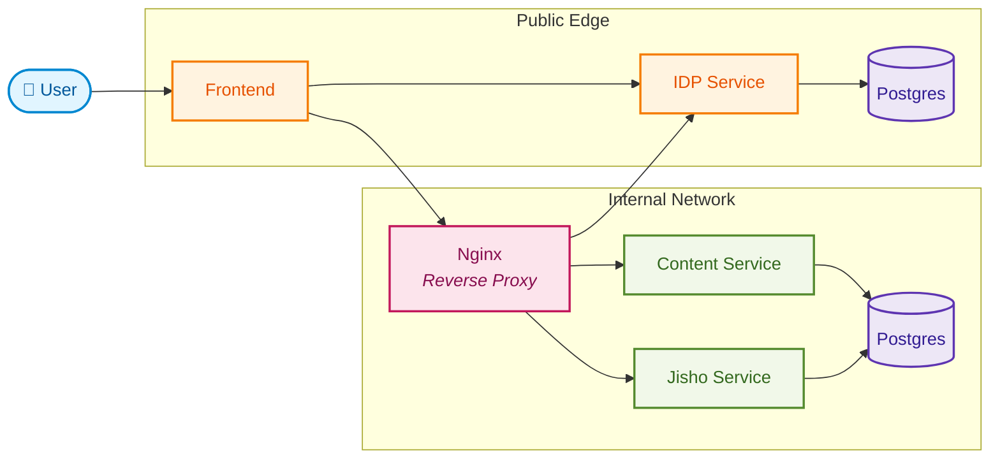

# Welcome to the documentation

This documentation is personal and i document some things in here that i might need or things that aren't often used. So this is basically treated as a cheat sheet ;

## Content

- [Welcome to the documentation](#welcome-to-the-documentation)
  - [Content](#content)
  - [Architecture](#architecture)
  - [⚙️ Commands](#️-commands)
    - [Quickstart Docker Compose](#quickstart-docker-compose)
    - [Generate new module](#generate-new-module)
  - [🔗 Sources](#-sources)

## Architecture



## ⚙️ Commands

### Quickstart Docker Compose

```bash
docker compose up
```

### Generate new module

```bash
go mod init example/package
```

## 🔗 Sources

|                             |                                                                    |
| --------------------------- | ------------------------------------------------------------------ |
| Name                        | Url                                                                |
| net/http documentation      | <https://go.dev/doc/articles/wiki/>                                |
| OAuth2 Client side          | <https://pkg.go.dev/golang.org/x/oauth2#section-readme>            |
| OAuth2 Client server side   | <https://pkg.go.dev/github.com/go-oauth2/oauth2/v4#section-readme> |
| OAuth2 Client with Postgres | <https://github.com/vgarvardt/go-oauth2-pg>                        |
